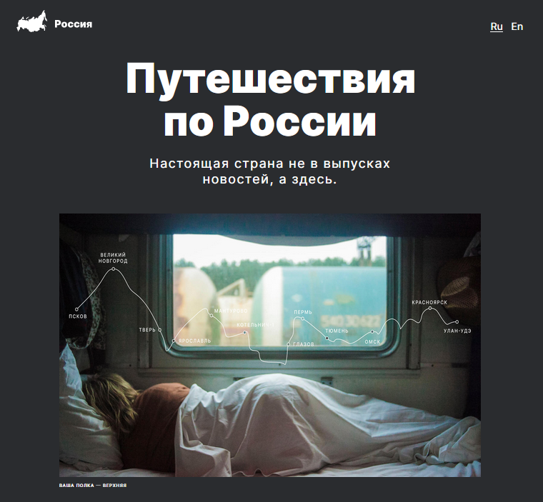
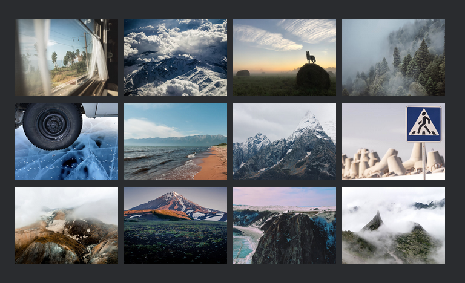
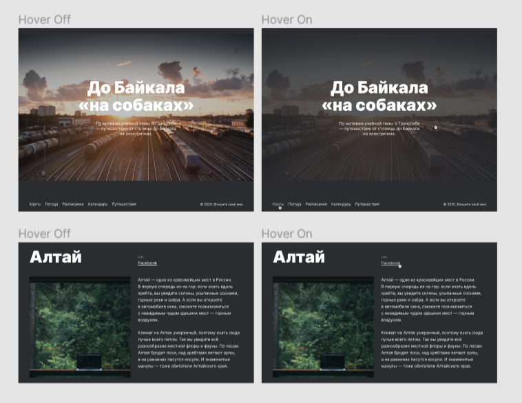
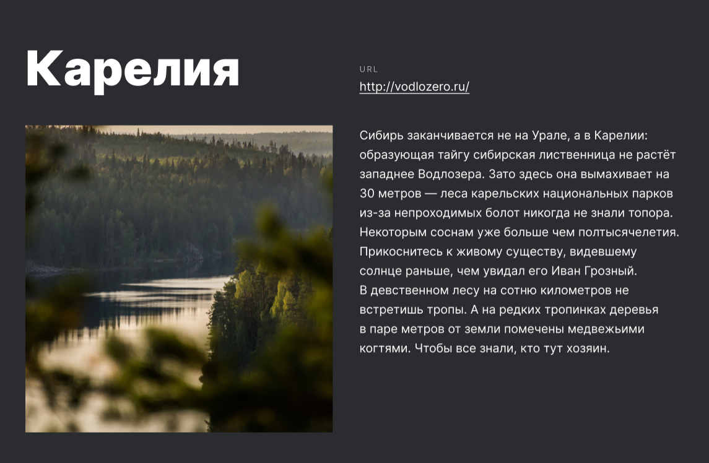

# Проект: Путешествие по России

### Обзор
* Интро
* Photo-grid
* Cover
* Places

__<h2 align="center">Интро</h2>__
_
Здесь проект о путешествии по России.
_

__<h2 align="center">Photo-grid</h2>__
_
В Фото-грид размещен блок, с картинками, которые расположены в грид среде.
_

__<h2 align="center">Cover</h2>__
_
В Ковер, реализованно наложение эфекта затемнения с определенной прозрачностью.
_

__<h2 align="center">Places</h2>__
_
Плейс, знакомит нас о красиввых местах России, с фото и ссылками.
_

* [Ссылка на Куршская коса](http://park-kosa.ru)
* [Ссылка на Кольский](https://yourshot.nationalgeographic.com/photos/?keywords=kolskiy)
* [Ссылка на Алтай](https://www.facebook.com/vera.bashmakova/posts/10156011613718822)
* [Ссылка на Зимний Байкал](https://vk.com/baikalmile)
* [Ссылка на Карелия](http://vodlozero.ru)

[__
Вверх
__](#anchor)